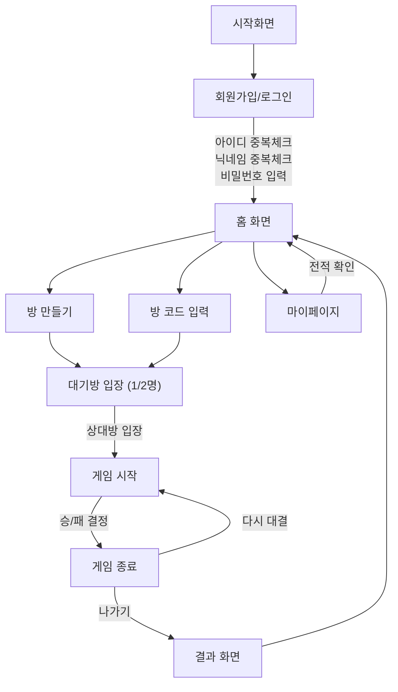

# 🎯 5 \~ 의 전략

> **오목**을 통해 **고려를 지켜내는 무협지 세계관** 기반의 전략 보드게임
> 실시간 대전과 방 생성, 전적 확인 등 다양한 기능을 포함한 웹 기반 게임

---

## 📸 게임 화면 미리보기

| 시작화면                             | 로그인                   |
| -------------------------------- | --------------------- |
|  |  |

| 로비                    | 방 만들기                          |
| --------------------- | ------------------------------ |
|  |  |

| 게임 진행화면                    |
| -------------------------- |
|  |

---

## ⚙️ 개발 환경 설정

### IntelliJ에서 `servlet-api.jar` 추가하기

1. IntelliJ 메뉴 → `File > Project Structure (⌘ + ;)`
2. 왼쪽에서 `Modules > JSP_MVC_Project` 선택
3. 상단 탭 `Dependencies` 클릭
4. 오른쪽 `+` 버튼 → `JARs or directories` 선택
5. servlet-api.jar 위치를 찾아 선택 (보통 Tomcat의 `lib` 폴더)
6. Scope는 **Provided**로 설정
   → Tomcat이 실행 시 제공하므로 `Provided`가 맞습니다

---

### ❗ 그래도 안된다면?

IntelliJ → Settings → Plugins → `Smart Tomcat` 설치!

---

## 🧩 게임 흐름 (플로우)

---

## 🗂️ ERD (Entity Relationship Diagram)

---

## 👥 역할 분담

| 기능        | 담당자                                                                                              |
| --------- | ------------------------------------------------------------------------------------------------ |
| **회원 관리** | 강지윤 ([kwiyoon](https://github.com/kwiyoon)), 최윤희 ([kwiyoon](https://github.com/kwiyoon))         |
| **인게임**   | 박재천 ([cheon1217](https://github.com/cheon1217)), 장해준 ([HaejunJang](https://github.com/HaejunJang)) |
| **방 관리**  | 김서하 ([standha](https://github.com/standha)), 문현준 ([Mouon](https://github.com/Mouon))             |

---

## 🛠 기술 스택

* **Backend**: Java, JSP, Servlet, Tomcat
* **Frontend**: HTML, CSS, JavaScript (Vanilla)
* **Database**: MySQL
* **실시간 통신**: WebSocket

---

## 🕹️ 게임 규칙 간단 설명

* 1:1 실시간 오목 대결
* 먼저 5목을 완성한 플레이어가 승리
* 동일한 방 코드로 입장하여 대결 가능

---