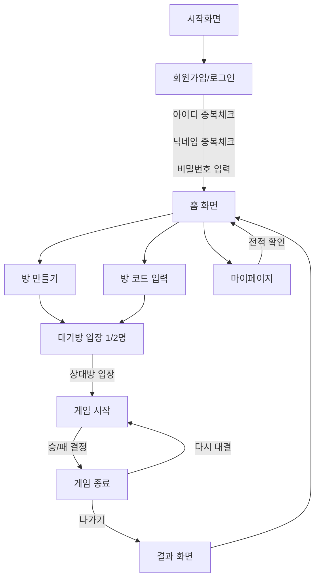

좋습니다! 게임 흐름과 스크린샷 이미지가 잘 연결되어 있어서 시각적으로도 이해하기 쉽고, 리드미에 추가하면 완성도가 확 올라갈 거예요. 아래는 제안하는 README 구성입니다. (폴더 구조 기준으로 이미지 경로는 상대경로로 잡았습니다.)

---

# 🎯 5 \~ 의 전략

> 오목을 통해 고려를 지켜내는 무협지 세계관 기반의 전략 보드게임

---

## 📸 게임 화면 미리보기

| 시작화면                              | 로그인                   |
| --------------------------------- | --------------------- |
|  |  |

| 로비                    | 방 만들기                          |
| --------------------- | ------------------------------ |
|  |  |

| 게임 진행화면                    |
| -------------------------- |
|  |

---

## ⚙️ 개발 환경 설정

### IntelliJ에서 servlet-api.jar 추가하기

1. IntelliJ 메뉴 → `File > Project Structure (⌘ + ;)`
2. 왼쪽에서 `Modules > JSP_MVC_Project` 선택
3. 상단 탭 `Dependencies` 클릭
4. 오른쪽 `+` 버튼 → `JARs or directories` 선택
5. servlet-api.jar 위치를 찾아 선택 (보통 Tomcat의 `lib` 폴더에 있음)
6. Scope를 **Provided**로 설정
   → Tomcat이 실행 시 제공하므로 `Provided`가 맞음

---

### ❗ 혹시 안되면?

IntelliJ → Settings → Plugins → `Smart Tomcat` 설치하세요!

---

## 📍 게임 흐름 (플로우)

---

## 🗂️ ERD

---

필요하다면 추가적으로 다음 항목도 넣을 수 있어요:

* 🔒 로그인/회원가입 기능 소개
* 🕹️ 게임 룰 간단 설명
* 👥 실시간 멀티플레이 기술 스택 (`Socket`, `JSP`, `Servlet`, `Tomcat`, `MySQL` 등)

---

원하시면 GitHub 배너, 기술 스택 배지, 오픈소스 안내 등도 추가해서 좀 더 깔끔한 깃허브 메인 페이지로 꾸며드릴게요! 추가할까요?
