---

# 🎯 5 \~ 의 전략

> 오목을 통해 고려를 지켜내는 무협지 세계관 기반의 전략 보드게임

---

## 📸 게임 화면 미리보기

| 시작화면                              | 로그인                   |
| --------------------------------- | --------------------- |
|  |  |

| 로비                    | 방 만들기                          |
| --------------------- | ------------------------------ |
|  |  |

| 게임 진행화면                    |
| -------------------------- |
|  |

---

## ⚙️ 개발 환경 설정

### IntelliJ에서 servlet-api.jar 추가하기

1. IntelliJ 메뉴 → `File > Project Structure (⌘ + ;)`
2. 왼쪽에서 `Modules > JSP_MVC_Project` 선택
3. 상단 탭 `Dependencies` 클릭
4. 오른쪽 `+` 버튼 → `JARs or directories` 선택
5. servlet-api.jar 위치를 찾아 선택 (보통 Tomcat의 `lib` 폴더에 있음)
6. Scope를 **Provided**로 설정
   → Tomcat이 실행 시 제공하므로 `Provided`가 맞음

---

### ❗ 혹시 안되면?

IntelliJ → Settings → Plugins → `Smart Tomcat` 설치하세요!

---

## 📍 게임 흐름 (플로우)

```mermaid
graph TD
    Start[시작화면] --> Login[회원가입/로그인]
    Login --> |" 아이디 중복체크<br/><br/>닉네임 중복체크<br/><br/>비밀번호 입력 "| Home[홈 화면]
    
    Home --> RoomCreate[방 만들기]
    Home --> RoomCode[방 코드 입력]
    Home --> Mypage[마이페이지]
    
    RoomCreate --> Waiting[대기방 입장 1/2명]
    RoomCode --> Waiting
    
    Waiting --> |"상대방 입장 "| GameStart[게임 시작]
    
    GameStart --> |" 승/패 결정 "| GameEnd[게임 종료]
    
    GameEnd --> |" 다시 대결 "| GameStart
    GameEnd --> |" 나가기 "| Result[결과 화면]
    
    Result --> Home
    Mypage --> |" 전적 확인 "| Home
```

---

## 🗂️ ERD

---
