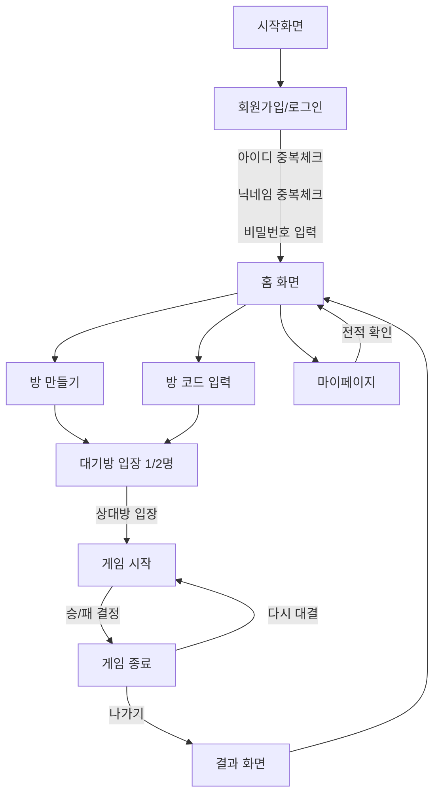

# 5 ~ 의 전략

## 개발 환경 설정

### IntelliJ에서 servlet-api.jar 추가하기

1. IntelliJ 메뉴 → `File > Project Structure (⌘ + ;)`
2. 왼쪽에서 `Modules > JSP_MVC_Project` 선택
3. 상단 탭 `Dependencies` 클릭
4. 오른쪽 `+` 버튼 → `JARs or directories` 선택
5. servlet-api.jar 위치를 찾아 선택 (서블릿 설치한거 열면 lib 폴더에 있음)
6. Scope를 꼭 `Provided`로 설정  
   (Tomcat이 실행 시 제공하므로 Provided가 맞음)

---

### 안되면!
inteliJ -> settings -> plugin -> smart tomcat 설치하셈요!  

### 플로우

### ERD

